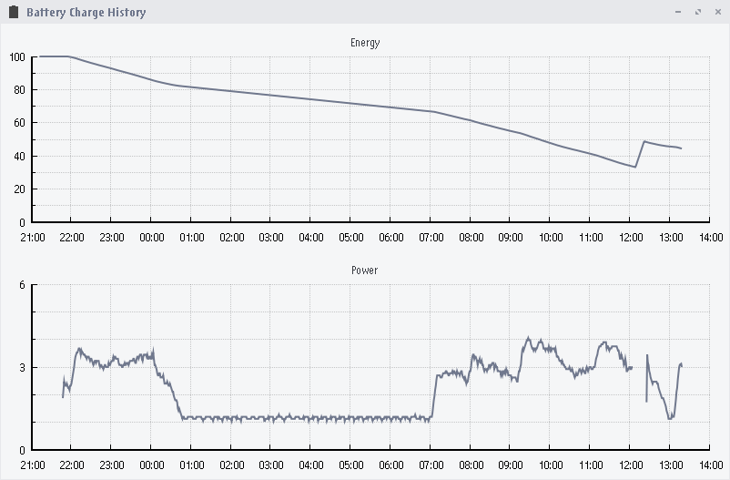

# Charge Log

Charge Log is a simple battery charge logger. It records battery charge into file and builds plots
of energy and power versus time using GUI utility.

## Building and Installing

Run `./configure && make && make install` to build and install Charge Log to your system.

You can also configure the following features:

- `--enable-systemd` — systemd support (charge-log service)
- `--enable-openrc` — OpenRC support (charge-log service)
- `--enable-gtk2` — GTK+ 2 GUI utility
- `--enable-gtk3` — GTK+ 3 GUI utility

Either GTK+ 2 or GTK+ 3 should be enabled.

## Usage

Start `charge-log` service to enable battery charge recording. Use `charge-log.desktop` GUI utility
to view plots.
